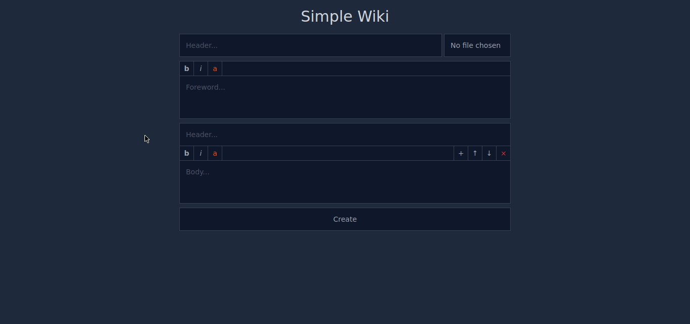

# Features (Clickable)

-   <details>
        <summary>Create articles with header, image, foreword, and sections</summary>
        </img>
    </details>

-   <details>
      <summary>Edit and delete articles</summary>
        </img>
    </details>

-   <details>
      <summary>Add, move or remove sections</summary>
        </img>
    </details>

-   <details>
      <summary>Simple text customization like BBCodes. Available bold, italic, and article tags. Last one adds link to article by header slug and optionally by section slug too</summary>
        </img>
    </details>

-   <details>
      <summary>Various validation for create and edit article</summary>
        </img>
    </details>

-   <details>
      <summary>Index with random articles</summary>
        </img>
    </details>

-   <details>
      <summary>Search by article header</summary>
        </img>
    </details>

-   <details>
      <summary>Pretty adaptive layouts</summary>
        </img>
    </details>

# Requirements

[Docker](https://docs.docker.com/compose/install/)

# Instalation

## Ubuntu

```
git clone https://github.com/MonstrHW/SimpleWiki.git
chmod -R 777 SimpleWiki
cd SimpleWiki

sudo docker run --rm \
    -u "$(id -u):$(id -g)" \
    -v "$(pwd):/var/www/html" \
    -w /var/www/html \
    laravelsail/php82-composer:latest \
    composer create-project --ignore-platform-reqs

sudo ./vendor/bin/sail up -d
sudo ./vendor/bin/sail npm install
sudo ./vendor/bin/sail artisan migrate:fresh
sudo ./vendor/bin/sail artisan storage:link
sudo ./vendor/bin/sail stop
```

# Start

```
sudo ./vendor/bin/sail up -d
sudo ./vendor/bin/sail npm run dev
```

http://127.0.0.1/

# Common commands

Seed database with fake articles and sections

```
sudo ./vendor/bin/sail artisan db:seed
```

Run tests

```
sudo ./vendor/bin/sail artisan test
```
